# BuchiFin - Project Documentation

BuchiFin is a business management platform built for the Indian agricultural supply chain. It connects Retailers, Distributors, Manufacturers, Government Employees, and platform Admins under one system to manage users, products, inventory, and stock across the agri-input industry (pesticides, fertilizers, seeds, etc.).

---

## Table of Contents

1. [System Overview](#1-system-overview)
2. [User Roles and Authentication](#2-user-roles-and-authentication)
3. [Dashboard](#3-dashboard)
4. [User Profile (My Profile)](#4-user-profile-my-profile)
5. [Admin Panel - User Management](#5-admin-panel---user-management)
   - [Retailer](#51-retailer)
   - [Manufacturer](#52-manufacturer)
   - [Distributor](#53-distributor)
   - [Agronomist](#54-agronomist)
6. [Product Management](#6-product-management)
7. [Inventory Management](#7-inventory-management)
8. [Data Types Reference](#8-data-types-reference)

---

## 1. System Overview

BuchiFin manages the agricultural supply chain where Manufacturers create products, Distributors move them through the supply chain, and Retailers sell them to end customers (farmers). Government employees use the platform for regulatory oversight. Admins manage all entities.

### High-Level System Architecture

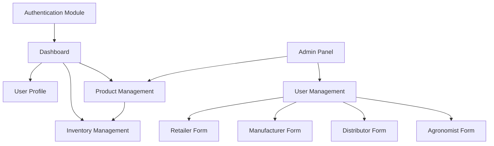

### How Entities Relate to Each Other

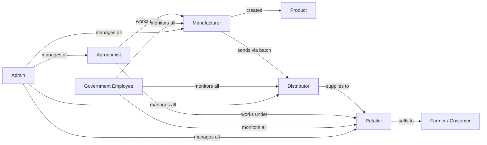

### Supply Chain Flow

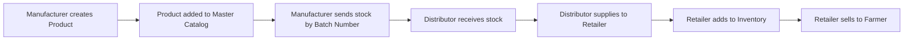

---

## 2. User Roles and Authentication

### What This Module Does

The authentication module controls who can access the platform and what they can do. Every user logs in with their phone number and OTP. Once authenticated, the system determines their role and shows them the appropriate dashboard and menu options.

### User Roles

| Role           | What They Do                                                                                          |
| -------------- | ----------------------------------------------------------------------------------------------------- |
| `retailer`     | Manages their shop inventory, adds products from authorized companies, sells to farmers and retailers |
| `distributor`  | Acts as a middleman between manufacturers and retailers, manages distribution of products             |
| `manufacturer` | Creates and manages products in the master catalog, controls product data, manages batch numbers      |
| `government`   | Has read-only access to all data for monitoring and regulation, cannot see financial details           |
| `admin`        | Full control over the entire system, creates/manages all user accounts, approves products             |

### Login Flow

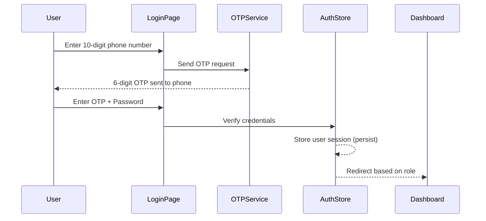

### Login Page Fields

| Field        | Type     | Validation              |
| ------------ | -------- | ----------------------- |
| Phone Number | tel      | Exactly 10 digits       |
| OTP          | text     | Exactly 6 digits        |
| Password     | password | Required, non-empty     |

### How It Works

1. The user enters their 10-digit phone number on the login page.
2. The system sends a 6-digit OTP to the phone.
3. Once the OTP is entered and verified, the password field becomes active.
4. On successful verification, the auth store saves the user object with `id`, `name`, `phone`, `role`, and `firmName`.
5. The session is persisted in local storage (key: `buchifin-auth`) so users stay logged in across page refreshes.
6. The user is redirected to `/dashboard` where the menu and features are filtered based on their role.

### Auth State Structure

```
User {
  id: string
  name: string
  phone: string
  role: "retailer" | "distributor" | "manufacturer" | "government" | "admin"
  firmName: string (optional)
}
```

The auth store exposes two actions: `login(user)` sets the user and marks `isAuthenticated` as true, and `logout()` clears everything.

---

## 3. Dashboard

### What This Module Does

The dashboard is the landing page after login. It gives the user a quick summary of their business -- total sales, product count, inventory value, and recent orders. It also provides shortcuts to common actions and displays charts for visual analysis.

### Dashboard Layout

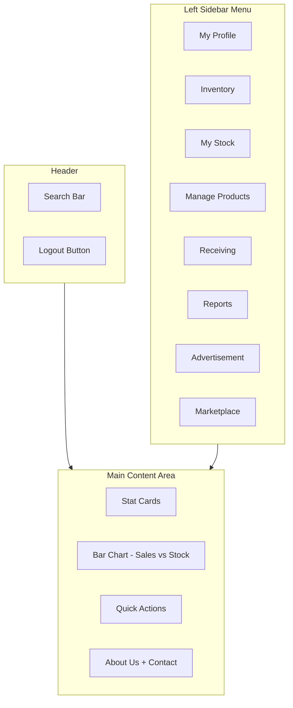

### Stat Cards

Each card shows a metric with its current value and trend from the previous period.

| Card            | What It Shows                               |
| --------------- | ------------------------------------------- |
| Total Sales     | Total revenue in rupees with % change       |
| Total Products  | Number of products with count of new ones   |
| Inventory Value | Total value of all stock with % change      |
| Orders          | Total order count with today's new orders   |

### Charts

- **Sales vs Stock Overview**: A bar chart showing monthly data with two bars per month -- one for sales amount and one for stock value. This helps users see if they are selling more than they are stocking or vice versa.

### Quick Actions

These are shortcut buttons on the dashboard for frequently used operations:

- Create Purchase Order
- Generate Invoice
- View Transactions

### Search

The header search bar allows users to search for products across the entire system using multiple criteria:

- Product name
- Product number / serial number
- Technical name

### Other Sections

- **About Us**: Displays information about BuchiFin and its services.
- **Contact Support**: Shows the support email address and phone number for user assistance.

---

## 4. User Profile (My Profile)

### What This Module Does

The My Profile page is where any logged-in user (Retailer, Distributor, Manufacturer) can view and edit their own business and personal information. It is a self-service page -- unlike the Admin Panel which is used by admins to manage other users.

### How It Works

- The page loads the current user's data from the auth store.
- All fields are read-only by default. The user clicks "Edit Profile" to enable editing.
- After making changes, clicking "Save Changes" persists the updates.
- Documents can be uploaded or viewed (download/preview).

### Profile Sections and Fields

#### Firm Details

These are the business entity details of the logged-in user.

| Field        | Description                                                | Editable |
| ------------ | ---------------------------------------------------------- | -------- |
| Firm Name    | The registered name of the business                        | Yes      |
| Firm Type    | Retailer / Distributor / Manufacturer                      | Yes      |
| GST Number   | Goods and Services Tax identification number               | Yes      |
| Firm Address | Full physical address of the business premises             | Yes      |

#### Owner Details

Personal details of the business owner or proprietor.

| Field         | Description                                   | Editable |
| ------------- | --------------------------------------------- | -------- |
| Owner Name    | Full name of the business owner               | Yes      |
| Phone Number  | Primary contact number                        | Yes      |
| Email         | Email address for correspondence              | Yes      |
| Owner Address | Residential address of the owner              | Yes      |

#### Bank Details

Banking information used for financial operations.

| Field          | Description                                  | Editable |
| -------------- | -------------------------------------------- | -------- |
| Account Name   | Name as it appears on the bank account       | Yes      |
| Account Number | Bank account number                          | Yes      |
| IFSC Code      | Indian Financial System Code of the branch   | Yes      |
| Bank Name      | Name of the bank                             | Yes      |

#### Documents

Users can upload and view their business documents. Each document has an upload button and a view/download button.

| Document         | Format         | Description                                                                  |
| ---------------- | -------------- | ---------------------------------------------------------------------------- |
| Firm License     | PDF / Image    | The business license issued by the relevant authority                        |
| Authority Letter | PDF / Image    | Authorization letter from companies, includes validity dates. Editable.      |
| PAN Card         | PDF / Image    | Permanent Account Number card for tax purposes                               |
| Aadhaar Card     | PDF / Image    | Government-issued identity document                                          |

### Component Interaction

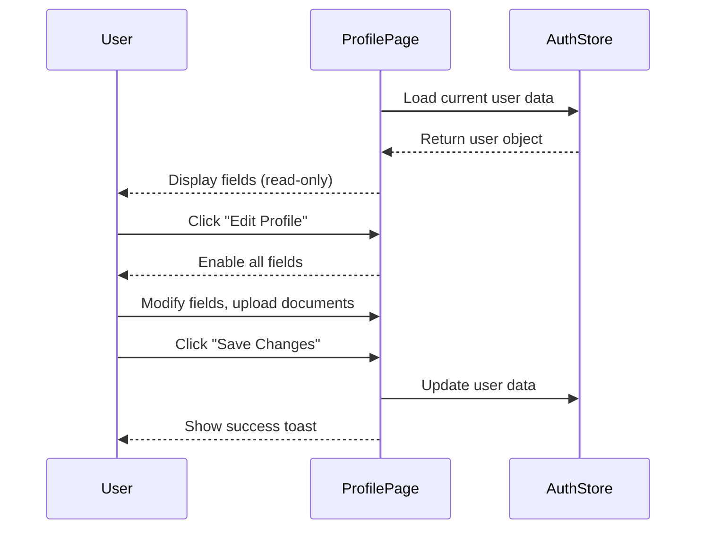

---

## 5. Admin Panel - User Management

### What This Module Does

The Admin Panel is used by admins to create, edit, and manage accounts for all user types: Retailers, Manufacturers, Distributors, and Agronomists. Each user type has its own registration form with specific fields and validation rules. The admin can also set user status (active, inactive, pending) and manage product approvals.

### How Forms Work

All admin forms share the same pattern:

1. **Create Mode**: A blank form to register a new entity. All required fields must be filled.
2. **Edit Mode**: Pre-fills the form with existing data loaded by entity ID. The admin can modify any field.
3. **Save as Draft**: Saves the current form state without validation, allowing the admin to come back later.
4. **Submit**: Validates all required fields and saves the entity.

### Admin Form Flow

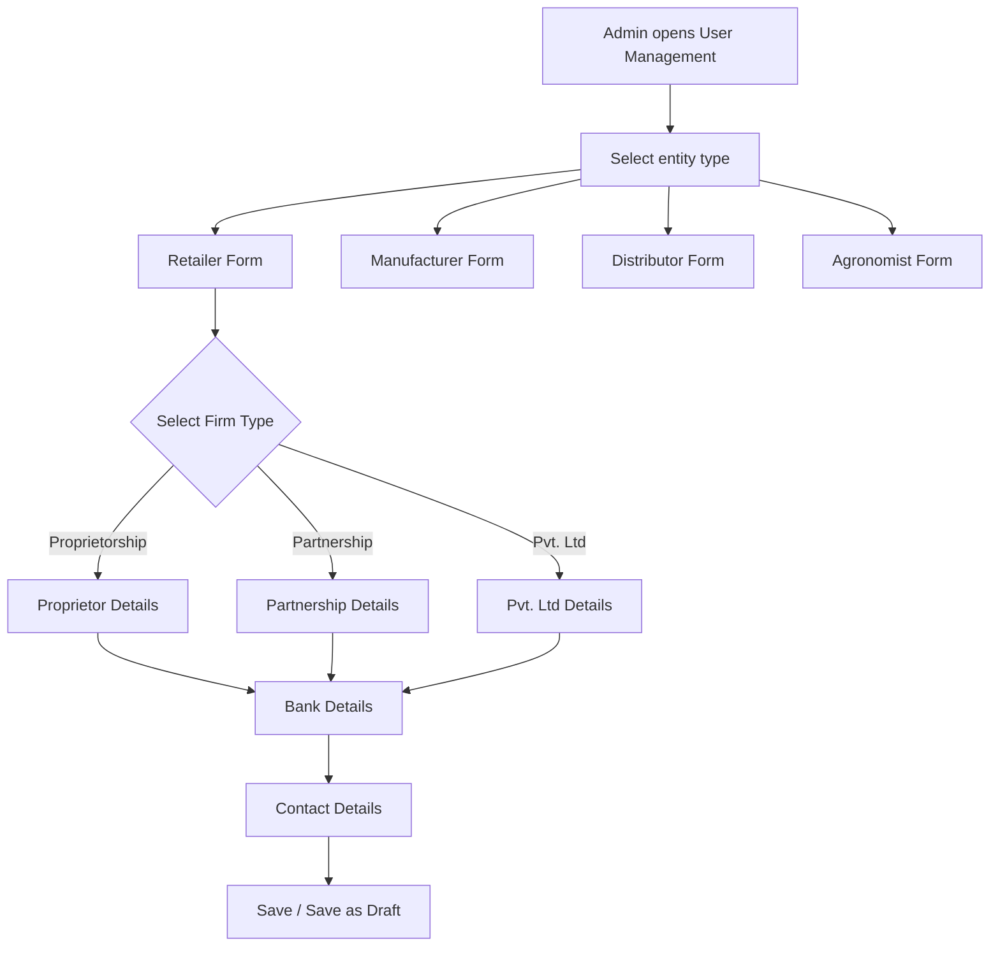

### Product Status Management (Admin)

The admin can set product status through the admin panel:

| Status     | Meaning                                              |
| ---------- | ---------------------------------------------------- |
| `active`   | Product is approved and visible in the system         |
| `inactive` | Product has been disabled by admin                    |
| `pending`  | Product was submitted and is awaiting admin approval  |
| `decline`  | Product was rejected by admin                         |
| `reverify` | Product needs re-verification after changes           |

---

### 5.1 Retailer

#### What This Is

A retailer is a business that sells agricultural products (pesticides, seeds, fertilizers) directly to farmers or other retailers. The admin creates retailer accounts by collecting their firm details, legal documents, ownership structure, and bank information.

#### How the Form is Structured

The retailer form is a multi-section form. The admin fills in firm details first, then selects the firm type which dynamically shows the appropriate ownership section, followed by bank details and contact information.

#### Form Component Interaction

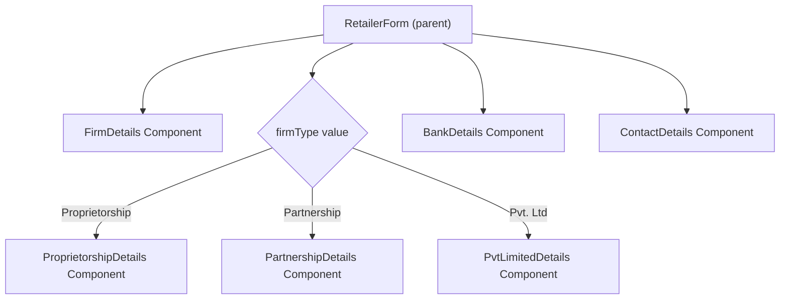

#### Section 1: Firm Details

These fields identify the business entity.

| Field           | Type              | Required | Description                                                                                    |
| --------------- | ----------------- | -------- | ---------------------------------------------------------------------------------------------- |
| Firm Name       | text              | Yes      | Registered business name                                                                       |
| Firm Address    | structured object | Yes      | Address Line 1, Address Line 2 (optional), Pincode, City, State                                |
| GST Number      | text              | Yes      | GST identification number of the firm                                                          |
| GST Documents   | file[] (multi)    | Yes      | Scanned copies of GST registration documents                                                   |
| Firm Licenses   | LicenseInfo[]     | Yes      | A firm can have multiple licenses for different categories (see below)                          |
| Block           | dropdown (static) | Yes      | Administrative block the firm belongs to                                                        |

#### Firm Licenses

A retailer can hold separate licenses for different product categories. Each license is tracked independently with its own number, validity, and documents.

| License Type | What It Covers                    | Fields Required                                |
| ------------ | --------------------------------- | ---------------------------------------------- |
| Seeds        | Permission to sell seed products  | License Number, Valid Upto Date, Documents     |
| Insecticide  | Permission to sell insecticides   | License Number, Valid Upto Date, Documents     |
| Fertilizer   | Permission to sell fertilizers    | License Number, Valid Upto Date, Documents     |

#### Section 2: Firm Type Details

After filling firm details, the admin selects the type of firm from a dropdown. This selection dynamically changes the form to show the appropriate ownership section.

**Proprietorship** -- A single-owner business.

| Field        | Type       | Required | Description                                         |
| ------------ | ---------- | -------- | --------------------------------------------------- |
| Name         | text       | Yes      | Full name of the proprietor                         |
| Phone        | tel        | Yes      | 10-digit phone number                               |
| Email        | email      | Yes      | Email address                                       |
| Aadhaar No.  | text       | Yes      | 12-digit Aadhaar number                             |
| Aadhaar Front| file       | Yes      | Photo/PDF of Aadhaar card front side                |
| Aadhaar Back | file       | Yes      | Photo/PDF of Aadhaar card back side                 |
| PAN No.      | text       | Yes      | 10-character PAN number                             |
| PAN Front    | file       | Yes      | Photo/PDF of PAN card front side                    |

**Partnership** -- A business owned by 2 or more partners. Minimum 2 partners must be added. The admin can add more partner entries dynamically.

Each partner requires:

| Field        | Type       | Required | Description                                         |
| ------------ | ---------- | -------- | --------------------------------------------------- |
| Name         | text       | Yes      | Full name of the partner                            |
| Designation  | text       | Yes      | Role in the partnership (e.g., Managing Partner)    |
| Phone        | tel        | Yes      | 10-digit phone number                               |
| Email        | email      | Yes      | Email address                                       |
| Aadhaar No.  | text       | Yes      | 12-digit Aadhaar number                             |
| Aadhaar Front| file       | Yes      | Photo/PDF of Aadhaar card front side                |
| Aadhaar Back | file       | Yes      | Photo/PDF of Aadhaar card back side                 |
| PAN No.      | text       | Yes      | 10-character PAN number                             |
| PAN Front    | file       | Yes      | Photo/PDF of PAN card front side                    |

**Pvt. Limited** -- A private limited company. Minimum 2 directors must be added.

Each director has the same fields as a partner (name, designation, phone, email, Aadhaar, PAN). Additionally, Pvt. Ltd requires:

| Field                            | Type  | Required | Description                                                     |
| -------------------------------- | ----- | -------- | --------------------------------------------------------------- |
| Company PAN No.                  | text  | Yes      | PAN number of the company (not individual)                      |
| Company PAN Front                | file  | Yes      | Photo/PDF of company PAN card                                   |
| Govt Registration Certificate    | file  | Yes      | Government registration certificate in PDF                      |
| Authorized Person - Name         | text  | Optional | Person authorized to act on behalf of the company               |
| Authorized Person - Phone        | tel   | Optional | Phone number of the authorized person                           |
| Authorized Person - Aadhaar      | text  | Optional | Aadhaar of the authorized person                                |
| Authorized Person - Aadhaar Front| file  | Optional | Photo/PDF of authorized person's Aadhaar front                  |
| Authorized Person - Aadhaar Back | file  | Optional | Photo/PDF of authorized person's Aadhaar back                   |
| MD Declaration Document          | file  | Optional | Declaration by the Managing Director of the company             |

#### Section 3: Bank Details

Banking information for the firm. Required for all firm types.

| Field            | Type  | Required | Description                                       |
| ---------------- | ----- | -------- | ------------------------------------------------- |
| Account Name     | text  | Yes      | Name on the bank account                          |
| Account Number   | text  | Yes      | Bank account number                               |
| IFSC Code        | text  | Yes      | 11-character bank IFSC code                       |
| Bank Name        | text  | Yes      | Name of the bank                                  |
| Cancelled Cheque | file  | Yes      | Photo of a cancelled cheque for verification      |

#### Section 4: Contact Details

Primary contact information for the firm.

| Field | Type  | Required | Description            |
| ----- | ----- | -------- | ---------------------- |
| Name  | text  | Yes      | Contact person's name  |
| Email | email | Yes      | Contact email address  |
| Phone | tel   | Yes      | Contact phone number   |

---

### 5.2 Manufacturer

#### What This Is

A manufacturer is a company that produces agricultural products (pesticides, fertilizers, seeds, growth promoters, etc.). They are the source of all products in the system. Manufacturers create product entries in the master catalog, manage batch numbers, and send products to distributors.

#### Data model (single source of truth)

The system uses three pillar schemas with no duplication of person or contact data:

- **User** – Single source for every person (super admin, manufacturer admin, directors, authorized persons). Stores only identity (name) and auth (password, role, status). No phone/email columns on User.
- **Phone** – Separate table: one row per phone number, linked to User. A user can have multiple phones; one can be primary (e.g. for login). Number is unique globally.
- **Email** – Separate table: one row per email address, linked to User. A user can have multiple emails; one can be primary. Address is unique globally.
- **Document** – All file documents; attached to the manufacturer (company-level) or to director/authorized person/bank within that manufacturer.
- **Manufacturer** – Company entity only: admin (userId), directors (link table: userId + manufacturerId + type, designation, aadhaar, pan), authorized persons (link table: userId + manufacturerId + aadhaar), company details, addresses, bank details, documents. No person name/phone/email stored on Manufacturer, Director, or AuthorizedPerson – all identity and contact come from User + Phone + Email.

Login accepts either phone number or email; the backend resolves the user via the Phone or Email table. Directors and authorized persons are always stored as User rows (with optional password for directors who do not log in); the Director and AuthorizedPerson tables only link a user to a manufacturer and hold role-specific fields (designation, aadhaar, pan).

#### How the Form is Structured

The manufacturer form collects company-level details first, then shows conditional sections based on the selected company type (Limited, Pvt. Ltd, Proprietorship, Partnership). Every company type requires an authorized person -- the individual who signs principal certificates and affidavits on behalf of the company.

#### Form Component Interaction

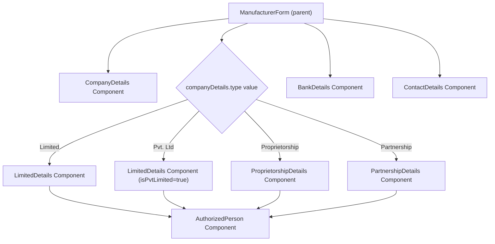

#### Section 1: Company Details

| Field                    | Type              | Required | Description                                                     |
| ------------------------ | ----------------- | -------- | --------------------------------------------------------------- |
| Company Name             | text              | Yes      | Registered name of the manufacturing company                    |
| Head Office Address      | structured object | Yes      | Address Line 1, Address Line 2 (optional), Pincode, City, State |
| License Number           | text              | Yes      | Manufacturing license number                                    |
| License Valid Upto       | date              | Yes      | Expiry date of the manufacturing license                        |
| License Documents        | file[] (multi)    | Yes      | Scanned copies of the license                                   |
| GST Number               | text              | Yes      | GST identification number                                       |
| GST Documents            | file[] (multi)    | Yes      | Scanned copies of GST registration                              |
| Udyog Aadhaar            | text              | Yes      | Udyog Aadhaar number (MSME registration)                        |
| Udyog Aadhaar Documents  | file[] (multi)    | Yes      | Scanned copies of Udyog Aadhaar                                 |
| Company Type             | dropdown          | Yes      | Limited / Pvt. Ltd / Proprietorship / Partnership               |

#### Section 2: Company Type Details

**Limited Company / Pvt. Limited Company** -- Minimum 2 directors required.

Each director has the same fields as a retailer partner/director (name, designation, phone, email, Aadhaar with front/back, PAN with front).

Additional fields for the company:

| Field                            | Type  | Required | Description                                                              |
| -------------------------------- | ----- | -------- | ------------------------------------------------------------------------ |
| Company PAN No.                  | text  | Yes      | PAN of the company entity                                                |
| Company PAN Front                | file  | Yes      | Photo/PDF of company PAN                                                 |
| Govt Registration Certificate    | file  | Yes      | Government registration certificate PDF                                  |

**Proprietorship Company**

Same proprietor fields as a retailer proprietorship (name, phone, email, Aadhaar, PAN).

**Partnership Company** -- Minimum 2 partners required.

Same partner fields as a retailer partnership.

#### Authorized Person (Required for ALL manufacturer types)

Unlike retailers where the authorized person is optional (only for Pvt. Ltd), every manufacturer must have an authorized person. This is the individual who signs principal certificates, affidavits, and authority letters on behalf of the company.

| Field                | Type  | Required | Description                                                           |
| -------------------- | ----- | -------- | --------------------------------------------------------------------- |
| Name                 | text  | Yes      | Full name of the authorized person                                    |
| Phone                | tel   | Yes      | Phone number                                                          |
| Aadhaar No.          | text  | Yes      | 12-digit Aadhaar number                                               |
| Aadhaar Front        | file  | Yes      | Photo/PDF of Aadhaar front                                            |
| Aadhaar Back         | file  | Yes      | Photo/PDF of Aadhaar back                                             |
| Declaration Document | file  | Yes      | Declaration document upload (company declaration by MD/directors)     |

#### Section 3: Bank Details

Same structure as Retailer bank details (Account Name, Account Number, IFSC, Bank Name, Cancelled Cheque).

#### Manufacturer Rights and Authorities

These define what a manufacturer can do in the system:

| Right                   | Description                                                                                          |
| ----------------------- | ---------------------------------------------------------------------------------------------------- |
| Add/Edit Products       | Manufacturers can add new products to the master catalog and edit their own product details           |
| Add to Inventory        | They can add products to their inventory                                                             |
| Manage Batch Numbers    | They send products to market by batch number, linked to specific distributors                         |
| Enable Distributors     | They can request the admin to allow their distributors to add and edit batch sizes                    |
| Edit on Request         | They have the right to edit product details on request (admin approval may be needed)                |

---

### 5.3 Distributor

#### What This Is

A distributor is an intermediary in the supply chain who moves products from manufacturers to retailers. The distributor panel can be merged with manufacturer or retailer panels. For example, if a retailer is also acting as a distributor, they can add an authorized person to gain access to distributor features (receiving, inventory editing) within their existing retailer panel.

#### How the Form is Structured

The admin first selects the distributor type from a dropdown. Each type has completely different form sections. "State Distributor" and "Under Manufacturer" require license and authorized person details. "Under Retailer" collects full retailer-like details since the distributor operates like a retail entity.

#### Form Component Interaction

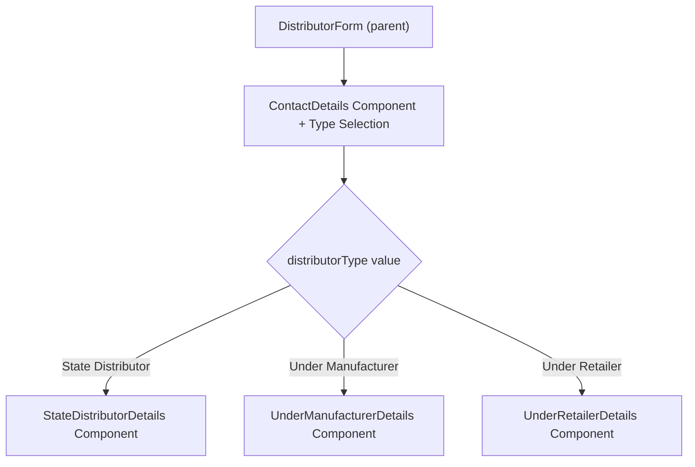

#### Distributor Type: State Distributor / Wholesaler

An independent distributor who operates at the state level. They have their own licenses and operate independently.

| Field              | Type              | Required | Description                                                      |
| ------------------ | ----------------- | -------- | ---------------------------------------------------------------- |
| License Number     | text              | Yes      | Distributor license number                                       |
| License Valid Upto | date              | Optional | Expiry date of the license                                       |
| License Documents  | file[] (multi)    | Optional | Scanned copies of the license                                    |
| GST Number         | text              | Yes      | GST identification number                                        |
| GST Documents      | file[] (multi)    | Optional | Scanned copies of GST registration                               |
| Address            | structured object | Yes      | Address Line 1, Address Line 2 (optional), Pincode, City, State  |
| Authorized Person  | object            | Yes      | Name, Phone, Aadhaar No., Aadhaar Front, Aadhaar Back            |

#### Distributor Type: Under Manufacturer

A distributor that operates directly under a specific manufacturer. They distribute that manufacturer's products.

| Field              | Type              | Required | Description                                                      |
| ------------------ | ----------------- | -------- | ---------------------------------------------------------------- |
| Manufacturer       | dropdown          | Yes      | Select the linked manufacturer from a list                       |
| License Number     | text              | Yes      | Distributor license number                                       |
| License Valid Upto | date              | Optional | Expiry date of the license                                       |
| License Documents  | file[] (multi)    | Optional | Scanned copies of the license                                    |
| GST Number         | text              | Yes      | GST identification number                                        |
| GST Documents      | file[] (multi)    | Optional | Scanned copies of GST registration                               |
| Address            | structured object | Yes      | Address Line 1, Address Line 2 (optional), Pincode, City, State  |
| Authorized Person  | object            | Yes      | Name, Phone, Aadhaar No., Aadhaar Front, Aadhaar Back            |

#### Distributor Type: Under Retailer

A distributor that operates under a retailer (essentially a wholesaler role for a retailer). This collects the full set of retailer-like details since the distributor functions as a retail business.

| Field              | Type              | Required | Description                                                                          |
| ------------------ | ----------------- | -------- | ------------------------------------------------------------------------------------ |
| Retailer           | dropdown          | Yes      | Select the linked retailer from a list                                               |
| Firm Name          | text              | Yes      | Name of the distribution firm                                                        |
| Firm Address       | structured object | Yes      | Full address (Address Line 1, Line 2, Pincode, City, State)                          |
| GST Number         | text              | Yes      | GST identification number                                                            |
| GST Documents      | file[] (multi)    | Optional | Scanned copies of GST registration                                                   |
| Firm Licenses      | LicenseInfo[]     | Yes      | Same license structure as retailer (seeds, insecticide, fertilizer)                   |
| Firm Type          | dropdown          | Yes      | Proprietorship / Partnership / Pvt. Ltd -- shows same sub-forms as retailer          |
| Bank Details       | object            | Yes      | Account Name, Account Number, IFSC, Bank Name, Cancelled Cheque                      |

---

### 5.4 Agronomist

#### What This Is

An agronomist is a field expert or consultant who works in the agricultural sector. They can be employed by a company, a retailer, work independently, or be a government employee. Agronomists are added to the system for record-keeping and can be linked to their employer.

Important rule: Agronomists can be added by Companies, Retailers, Self, or Government Employees, but they **cannot be deleted directly**. To remove an agronomist, a deletion request must be raised and approved.

#### How the Form is Structured

The form collects basic contact information, then uses a dropdown for "Employee Under" which conditionally shows additional fields (company name or retailer selection). Bank details and qualification documents are collected at the end.

#### Form Component Interaction

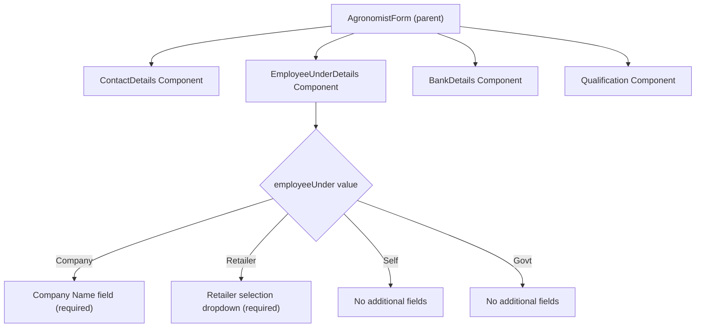

#### Contact Details

| Field   | Type  | Required | Description                         |
| ------- | ----- | -------- | ----------------------------------- |
| Name    | text  | Yes      | Full name of the agronomist         |
| Email   | email | Yes      | Email address                       |
| Phone   | tel   | Yes      | 10-digit phone number               |
| Address | text  | Yes      | Residential address                 |

#### Employee Under

This determines who the agronomist works for. The dropdown selection changes what additional field is shown.

| Selection | What Happens                                                        |
| --------- | ------------------------------------------------------------------- |
| Company   | A text field appears to enter the company name (required)           |
| Retailer  | A dropdown appears to select the retailer by name/ID (required)    |
| Self      | No additional fields -- the agronomist is independent               |
| Govt      | No additional fields -- the agronomist is a government employee     |

When the selection changes, the previously filled conditional fields are cleared.

#### Bank Details

Same structure as all other entities (Account Name, Account Number, IFSC, Bank Name, Cancelled Cheque).

#### Qualification

| Field                  | Type | Required | Description                                              |
| ---------------------- | ---- | -------- | -------------------------------------------------------- |
| Qualification Document | file | Optional | Supporting document in PDF format (degree, certificate)  |

---

## 6. Product Management

### What This Module Does

Product Management is the master catalog of all agricultural products in the system. Products are created by manufacturers or by the admin on behalf of manufacturers. Once a product is created and approved, it becomes available for distributors and retailers to add to their inventory. Retailers can also submit product requests via a proforma, which the manufacturer then reviews and adds.

### Who Can Manage Products

| Role         | Can Create | Can Edit | Can View | Can Approve/Decline |
| ------------ | ---------- | -------- | -------- | ------------------- |
| Admin        | Yes        | Yes      | Yes      | Yes                 |
| Manufacturer | Yes        | Own only | Yes      | No                  |
| Retailer     | No (proforma only) | No | Yes      | No                  |
| Distributor  | No         | No       | Yes      | No                  |
| Government   | No         | No       | Yes (no financial) | No      |

### Product Creation Flow

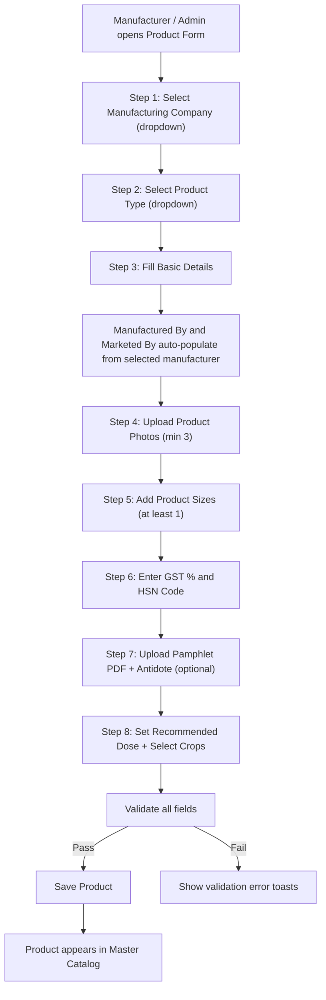

### Product Types

These categories define what kind of agricultural input the product is.

| Type                              | Description                                            |
| --------------------------------- | ------------------------------------------------------ |
| Pesticide                         | Chemical to kill pests                                 |
| Fungicide                         | Chemical to kill fungi                                 |
| Plant Growth Promoter (PGR)       | Substance to promote plant growth                     |
| NPK                               | Nitrogen-Phosphorus-Potassium compound fertilizer      |
| Fertilizer                        | General soil nutrient supplement                       |
| Bio Pesticide                     | Biological pest control agent                          |
| Bio Fungicide                     | Biological fungal control agent                        |
| Bio Plant Growth Promoter (PGR)   | Biological plant growth substance                      |
| Bio Fertilizer                    | Biological soil nutrient supplement                    |

### Product Form -- All Fields

#### Manufacturer & Type Selection

| Field                 | Type     | Required | Description                                                           |
| --------------------- | -------- | -------- | --------------------------------------------------------------------- |
| Manufacturing Company | dropdown | Yes      | Select from list of registered manufacturers                          |
| Product Type          | dropdown | Yes      | Select from the product types listed above                            |

When the manufacturer is selected, the `manufacturedBy` and `marketedBy` fields are automatically populated with the selected manufacturer's ID.

#### Basic Details

| Field               | Type     | Required | Description                                                                              |
| ------------------- | -------- | -------- | ---------------------------------------------------------------------------------------- |
| Product Name        | text     | Yes      | Common market name of the product                                                        |
| Technical Name      | text     | Yes      | Technical / scientific / chemical name                                                    |
| Manufactured By     | text     | Yes      | Auto-filled from manufacturer selection                                                   |
| Marketed By         | text     | Yes      | Auto-filled from manufacturer selection (can be different company)                        |
| Product Description | textarea | Yes      | Technical description of the product -- what it does, how it works                        |
| CIR Number          | text     | No       | Chemical Registration Number (Product Technical Registration). Not required for retailer proforma |

#### Product Photos

| Field          | Type          | Required | Description                                     |
| -------------- | ------------- | -------- | ----------------------------------------------- |
| Product Photos | file[] (multi)| Yes      | Minimum 3 photos, maximum 4 photos of the product |

#### Product Sizes

A product can have multiple size variants. Each size defines a packaging configuration. At least 1 size is required.

| Field            | Type           | Required | Description                                                   |
| ---------------- | -------------- | -------- | ------------------------------------------------------------- |
| Quantity         | text (numeric) | Yes      | Numeric value of the size (e.g., 500, 1, 250)                |
| Unit             | text           | Yes      | Unit of measurement: ml, L, kg, g, etc.                      |
| Bottles Per Case | text (numeric) | Yes      | How many units make one case (e.g., 20 bottles = 1 case)     |
| Packaging Photos | file[] (multi) | No       | Photos specific to this size's packaging                      |

#### Tax Information

| Field          | Type           | Required | Description                                              |
| -------------- | -------------- | -------- | -------------------------------------------------------- |
| GST Percentage | text (numeric) | Yes      | Applicable GST rate (e.g., 5, 12, 18)                   |
| HSN Code       | text           | Yes      | Harmonized System Nomenclature code for tax classification|

#### Documents

| Field             | Type | Required | Description                                                               |
| ----------------- | ---- | -------- | ------------------------------------------------------------------------- |
| Product Pamphlet  | file | Yes      | PDF document with full product information, usage instructions            |
| Product Antidote  | file | No       | Information about antidotes/countermeasures. Can be included in pamphlet. |

#### Dosage & Crops

| Field             | Type           | Required | Description                                                    |
| ----------------- | -------------- | -------- | -------------------------------------------------------------- |
| Recommended Dose  | text           | Yes      | Dosage amount per unit area (e.g., "100ml")                    |
| Dose Unit         | radio          | Yes      | Per acre or per hectare                                        |
| Recommended Crops | multi-select   | Yes      | Select from predefined crop list (at least 1 required)         |
| Other Crops       | text[] (tags)  | No       | Custom crop names added by the user if not in predefined list  |

### Validation Rules

When saving (not as draft), the following validations run. If any fail, a toast error is shown and the save is blocked.

| Rule                                              | Error Message                                    |
| ------------------------------------------------- | ------------------------------------------------ |
| Manufacturer must be selected                     | "Please select a manufacturing company"          |
| Product type must be selected                     | "Please select product type"                     |
| Product name and technical name are required       | "Please fill in product name and technical name" |
| Manufactured by and marketed by are required       | "Please select manufactured by and marketed by"  |
| GST percentage is required                         | "Please enter GST percentage"                    |
| HSN code is required                               | "Please enter HSN code"                          |
| Minimum 3 product photos                          | "Please upload at least 3 product photos"        |
| At least 1 product size                           | "Please add at least one product size"           |
| Each size must have quantity, unit, bottles/case   | "Please fill in all fields for product size N"   |
| Product description is required                    | "Please enter product description"               |
| Product pamphlet PDF is required                   | "Please upload product pamphlet PDF"             |
| Recommended dose is required                       | "Please enter recommended dose"                  |
| Dose unit must be selected                         | "Please select recommended dose unit"            |
| At least 1 recommended crop                       | "Please select at least one recommended crop"    |

Draft saves skip all validation.

### Bulk Upload

Multiple products can be added at once by uploading an Excel sheet. The Excel must contain all the required product details in the expected column format. This is useful for manufacturers who need to onboard their entire product catalog at once.

### Retailer Product Proforma

Retailers cannot create products directly but can submit a proforma (product request form) with the product details they want added. The manufacturer then reviews and adds the product. The CIR Number field is not required in the retailer's proforma.

---

## 7. Inventory Management

### What This Module Does

Inventory Management handles physical storage locations and the products stored in them. Each inventory represents a real-world location -- a warehouse, retail shop, godown, or distribution center. Products from the master catalog are added to these inventories with batch-level tracking (batch number, manufacturing date, expiry date, stock quantity).

### How Inventory Connects to Other Modules

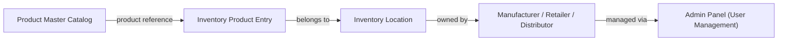

### Inventory Creation Flow

Creating a new inventory is a 3-step process:

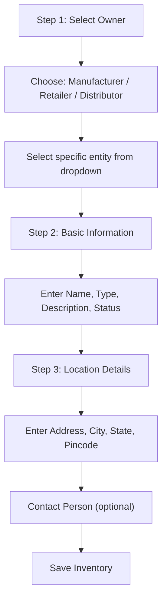

### Inventory (Storage Location)

An inventory is a named physical location. It is always owned by a specific manufacturer, retailer, or distributor.

#### Step 1: Owner Selection

| Field      | Type     | Required | Description                                                   |
| ---------- | -------- | -------- | ------------------------------------------------------------- |
| Owner Type | radio    | Yes      | Manufacturer / Retailer / Distributor                         |
| Owner      | dropdown | Yes      | Select the specific entity (shows name and location)          |

After selecting an owner, a preview card shows the selected entity's name and location for confirmation.

#### Step 2: Basic Information

| Field       | Type     | Required | Description                                                        |
| ----------- | -------- | -------- | ------------------------------------------------------------------ |
| Name        | text     | Yes      | Name of the inventory (e.g., "Main Warehouse", "Retail Shop - Gurgaon") |
| Type        | radio    | Yes      | One of the inventory types (see below)                             |
| Description | textarea | No       | Brief description of what this location is used for                |
| Status      | dropdown | Yes      | Active or Inactive                                                 |

#### Inventory Types

| Type                | Description                                                           |
| ------------------- | --------------------------------------------------------------------- |
| Warehouse           | Large storage facility for bulk product storage                       |
| Shop                | Retail outlet where products are sold directly to customers           |
| Godown              | Storage facility, often with temperature control for sensitive products|
| Distribution Center | Hub location from which products are distributed to other locations    |

#### Step 3: Location Details

| Field          | Type     | Required | Description                                       |
| -------------- | -------- | -------- | ------------------------------------------------- |
| Address Line 1 | text     | Yes      | Building name, street address                     |
| Address Line 2 | text     | No       | Area, landmark                                    |
| City           | text     | Yes      | City name                                         |
| State          | dropdown | Yes      | Select from all Indian states and union territories|
| Pincode        | text     | Yes      | 6-digit Indian pincode                            |

#### Contact Person (Optional)

| Field | Type  | Required | Description                                 |
| ----- | ----- | -------- | ------------------------------------------- |
| Name  | text  | No       | Name of the person in charge of this location|
| Phone | tel   | No       | 10-digit phone number                       |
| Email | email | No       | Email address                               |

### Products in Inventory

Once an inventory is created, products can be added to it. Each product entry tracks the specific batch, quantity, pricing, and dates.

#### Inventory Product Fields

| Field          | Type              | Required | Description                                                    |
| -------------- | ----------------- | -------- | -------------------------------------------------------------- |
| Product ID     | reference         | Yes      | Links to the master product catalog entry                      |
| Product Name   | text (auto-fill)  | Yes      | Name from the product catalog (cached for display)             |
| Company        | text              | Yes      | Name of the manufacturing company                              |
| Size           | text              | Yes      | Product size variant (e.g., "500ml", "1kg")                    |
| Stock          | number            | Yes      | Current quantity of this product at this location              |
| Price          | number            | Yes      | Price per unit in rupees                                       |
| Status         | computed           | Auto     | In Stock / Low Stock / Out of Stock (derived from stock level) |
| Source Type    | dropdown          | Yes      | Manufacturer / Other (where the stock came from)               |
| Batch Number   | text              | Optional | Unique batch identifier from the manufacturer                  |
| Mfg Date       | date              | Optional | Manufacturing date of this batch                               |
| Expiry Date    | date              | Optional | Expiry date of this batch                                      |
| Purchased From | text              | Optional | Name of the supplier this stock was purchased from             |
| Unit           | dropdown          | Yes      | kg, g, L, ml, Pack, Bag, Bottle, Quantal                      |

### Inventory List View

The inventory list page shows all inventories in a paginated table (10 items per page) with search and summary statistics.

#### List Table Columns

| Column       | Description                                     |
| ------------ | ----------------------------------------------- |
| Name         | Inventory name + description snippet            |
| Location     | Address with map pin icon                       |
| Type         | Color-coded badge (Warehouse/Shop/Godown/DC)    |
| Products     | Total product count in this inventory           |
| Low Stock    | Count of products running low                   |
| Out of Stock | Count of products with zero stock               |
| Status       | Active/Inactive badge                           |
| Actions      | View / Edit / Delete buttons                    |

#### Overview Stats (Across All Inventories)

| Stat              | Description                                       |
| ----------------- | ------------------------------------------------- |
| Total Inventories | Count of all inventory locations                  |
| Total Products    | Sum of all products across all inventories         |
| Low Stock Items   | Total low stock items across all inventories       |
| Total Value       | Sum of (stock x price) across all inventories      |

### Product View Within an Inventory

When the user clicks on a specific inventory, they see all products stored there. This view includes:

- A header showing the inventory name, type icon, and location
- Stat cards: Total Products, In Stock, Low Stock, Out of Stock
- A search bar (search by product name, company, or batch number)
- Filter dropdowns: by company, by status
- A product table with columns: Product, Company, Size, Stock, Price, Status, Actions
- Pagination (10 per page)

### Stock Management Logic

When adding a product to inventory that already exists (same `productId`):

1. The quantities are summed: `newQuantity = existingQty + addedQty`
2. The average cost is recalculated using weighted average:
   ```
   newAverageCost = (existingAvgCost * existingQty + newCost * newQty) / totalQty
   ```
3. The `lastUpdated` timestamp is set to the current time.

If the product does not exist in the inventory, it is added as a new entry with a generated ID.

### Inventory Component Interaction

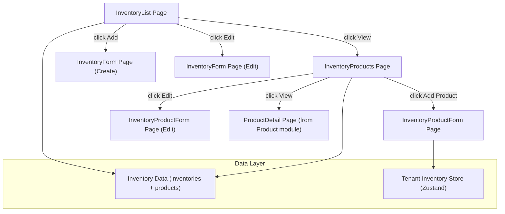

---

## 8. Data Types Reference

### Enums

| Type            | Values                                                                                                                                            |
| --------------- | ------------------------------------------------------------------------------------------------------------------------------------------------- |
| FirmType        | `Proprietorship`, `Partnership`, `Pvt. Ltd`, `Limited`                                                                                            |
| DistributorType | `State Distributor`, `Under Manufacturer`, `Under Retailer`                                                                                       |
| EmployeeUnder   | `Company`, `Retailer`, `Self`, `Govt`                                                                                                             |
| UserStatus      | `active`, `inactive`, `pending`                                                                                                                   |
| LicenseType     | `seeds`, `insecticide`, `fertilizer`                                                                                                              |
| ProductType     | `Pesticide`, `Fungicide`, `Plant Growth Promoter (PGR)`, `NPK`, `Fertilizer`, `Bio Pesticide`, `Bio Fungicide`, `Bio Plant Growth Promoter (PGR)`, `Bio Fertilizer` |
| UserRole        | `retailer`, `distributor`, `manufacturer`, `government`, `admin`                                                                                  |

### Common Data Structures

These structures are reused across multiple modules.

#### BankDetails

Used in: Retailer, Manufacturer, Distributor (Under Retailer), Agronomist, Profile

| Field           | Type             | Description                          |
| --------------- | ---------------- | ------------------------------------ |
| accountName     | string           | Name on the bank account             |
| accountNumber   | string           | Bank account number                  |
| ifsc            | string           | 11-character IFSC code               |
| bankName        | string           | Name of the bank                     |
| cancelledCheque | file (optional)  | Photo of cancelled cheque            |

#### FirmAddress

Used in: Retailer (firmAddress), Manufacturer (headOfficeAddress), Distributor (address)

| Field    | Type             | Description                |
| -------- | ---------------- | -------------------------- |
| address1 | string           | Primary address line       |
| address2 | string (optional)| Secondary address line     |
| pincode  | string           | 6-digit Indian pincode     |
| city     | string           | City name                  |
| state    | string           | Indian state name          |

#### LicenseInfo

Used in: Retailer (firmLicenses), Distributor Under Retailer (firmLicenses)

| Field         | Type             | Description                      |
| ------------- | ---------------- | -------------------------------- |
| licenseType   | LicenseType      | seeds / insecticide / fertilizer |
| licenseNumber | string           | License number                   |
| validUptoDate | string (optional)| Expiry date                      |
| documents     | file[]           | Supporting documents             |

#### ProprietorPartnerDirector

Used in: All firm type detail sections (Proprietorship, Partnership, Pvt. Ltd / Limited) across Retailer, Manufacturer, and Distributor.

| Field       | Type             | Description                              |
| ----------- | ---------------- | ---------------------------------------- |
| name        | string           | Full name                                |
| designation | string (optional)| Role/title (for partners and directors)  |
| aadhaar     | string           | 12-digit Aadhaar number                  |
| aadhaarFront| file (optional)  | Aadhaar card front side image/PDF        |
| aadhaarBack | file (optional)  | Aadhaar card back side image/PDF         |
| pan         | string           | 10-character PAN number                  |
| panFront    | file (optional)  | PAN card front side image/PDF            |
| email       | string           | Email address                            |
| phone       | string           | Phone number                             |

#### ProductSize

Used in: Product Management

| Field           | Type             | Description                                  |
| --------------- | ---------------- | -------------------------------------------- |
| quantity        | string           | Size value (e.g., "500", "1")                |
| unit            | string           | Unit of measurement (ml, L, kg, g)           |
| bottlesPerCase  | string           | Number of units per case                     |
| packagingPhotos | file[] (optional)| Photos of the packaging for this size        |

#### BaseUser

All user types (Retailer, Manufacturer, Distributor, Agronomist, Admin) extend this base structure.

| Field     | Type       | Description                  |
| --------- | ---------- | ---------------------------- |
| id        | string     | Unique identifier            |
| name      | string     | Full name                    |
| email     | string     | Email address                |
| phone     | string     | Phone number                 |
| status    | UserStatus | active / inactive / pending  |
| createdAt | string     | ISO date string of creation  |

---

## Government Employees

Government employees have access to all features of the system with one key restriction:

- They can access the reports section for every user but **without financial details** (no sales amounts, no purchase prices, no billing data).
- This allows them to monitor and regulate agricultural businesses while maintaining the privacy of commercial information.
- They use the same login flow (phone + OTP + password) and see the same dashboard layout, but financial metrics and financial columns in reports are hidden for their role.
